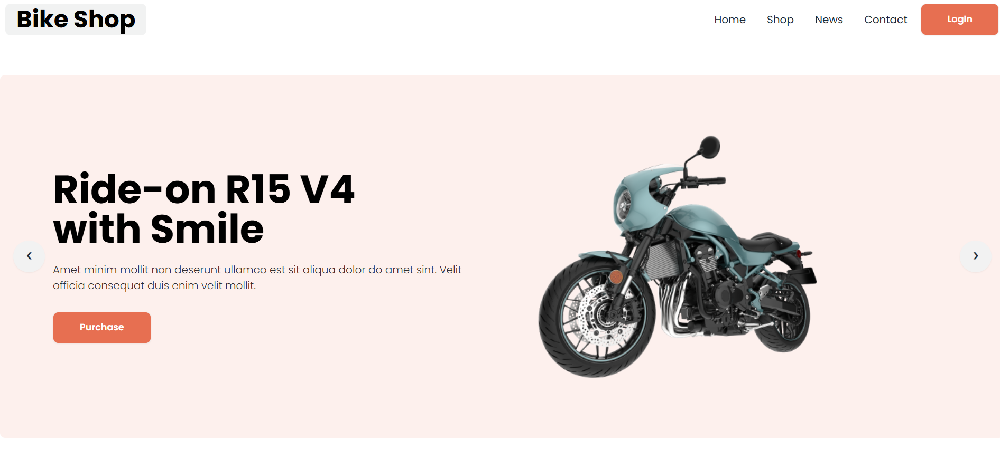

# 🚴‍♂️ Bike Shop – Responsive Bike Selling Landing Page

**Bike Shop** is a fully responsive landing page designed for showcasing and selling bikes. Built using **HTML** and **Tailwind CSS** and **DaisyUI**, it provides a clean, modern interface across all devices. The site features a dynamic slider, product highlights, customer reviews, FAQs, and a strong call-to-action — making it ideal for any bike selling agency.

[🔗 Live Demo](https://devo-ab.github.io/bike-shop)

---

## 🌟 Features

- ✅ Fully responsive design (mobile, tablet, desktop)
- 🖼️ Hero banner with image slider
- 🚲 Featured Bikes section
- 🆕 Latest Bikes display
- 💬 Client Review section
- ❓ Frequently Asked Questions (FAQs)
- 🔗 Smooth navigation with navbar
- 👣 Modern and clean footer

---

## 💻 Built With

- **HTML5**
- **Tailwind CSS**
- **DaisyUI**
- **Custom Assets (images, icons, slider)**

---

## 📁 Folder Structure

```
bike-shop/
├── assets/
│   ├── icons/              # Icon assets
│   ├── images/             # Website images
│   ├── logo/               # Logo files
│   ├── slider/             # Banner/slider images
├── preview/                # Screenshots for README
├── index.html              # Main landing page
└── README.md               # Project documentation
└── tailwind.config.js      # Tailwind config
```

---

## 🖼️ Screenshots

### 🧭 Hero Banner & Navbar



### 🚲 Latest Bikes


### 👣 Full page preview


---

## 📲 How to Use Locally

1. **Clone the repo**
   ```bash
   git clone https://github.com/devo-ab/bike-shop.git
   cd bike-shop
   ```

# 👤 Author

# Avi Jit

## :mailbox: Reach me out

<p align="left">
<a href="https://linkedin.com/in/itsavijitb" target="blank"></a>
<a href="https://twitter.com/itsavijitb" target="blank"></a>
<a href="https://facebook.com/itsavijitb" target="blank"></a>
<a href="https://instagram.com/itsavijitb" target="blank"></a>
</p>
